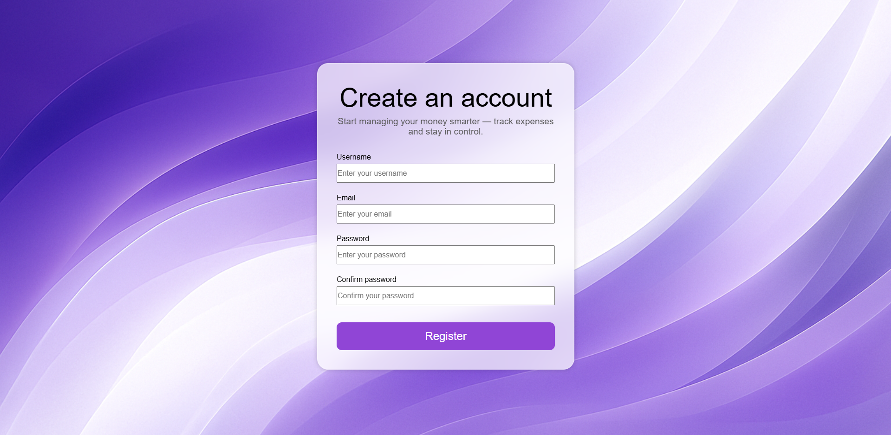
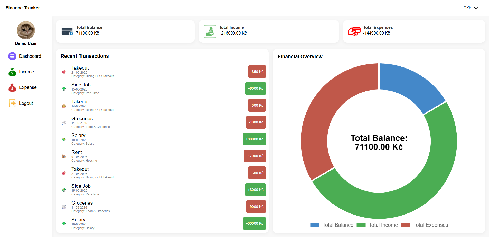
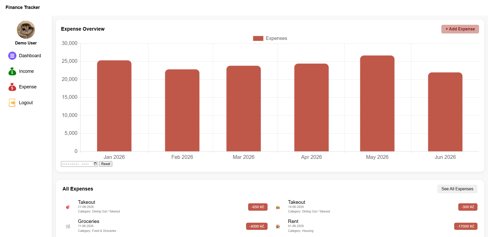
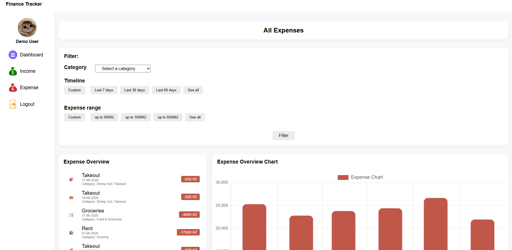

# Finance Tracker

## Description
Finance Tracker is a full-stack web application for tracking personal income and expenses.
Users can log in, add transactions, categorize them and monitor balance changes over time.
The app provides charts, filters and multi-currency support to help users visualize financial activity.


## Features
- Add and delete income and expenses
- Filter by categories, date and amount range
- Interactive chart for income, expenses and total balance
- Supports 5 currencies: CZK, USD, EUR, GBP, JPY
- User registration and login
- Responsive layout


## Tech Stack

### Frontend
- HTML, CSS, JavaScript
- Chart.js

### Backend
- Node.js, Express.js

### Auth
- JWT + bcrypt

### Database
- MongoDB, Mongoose

### Testing
- Vitest, Testing Library, jsdom


## Installation

### Backend

1. Clone the repository
```bash
git clone https://github.com/Luan2118/finance-tracker-project.git
cd finance-tracker-project
```

2. Install backend dependencies
```bash
cd backend
npm install
```

3. Create a `.env` file in the backend folder and add:
```env
DATABASE_URL=your_mongodb_connection_string
ACCESS_TOKEN_SECRET=youraccesstokensecret
REFRESH_TOKEN_SECRET=yourrefreshtokensecret
```

4. Start backend server
```bash
npm start
```
### Frontend

5. Start frontend
Open `frontend/index.html` using a local server (e.g., VSCode Live Server)


## Screenshots

### Registration


### Dashboard


### Expense page


### All Expenses page


## Testing

- Unit tests using Vitest
- DOM tests using @testing-library/dom with jsdom
- Integration tests for page flows

To run all tests:
```bash
npm test
```


## Deployment

### Frontend (Vercel)
- Hosted as a static site on Vercel
- Entry point: `index.html` (login page)

**Live URL:**
https://finance-tracker-project-sigma.vercel.app/

---

### Backend (Render)
- Node.js + Express API deployed on Render.
- MongoDB Atlas used as a database
- JWT authentication (access + refresh tokens) stored in **HttpOnly cookies**.
- CORS configured to allow the Vercel domain and send credentials.
- Render free-tier may cause a **15–30s cold start delay** on the first request.

**API Base URL:**  
https://finance-tracker-project-l7rf.onrender.com/
