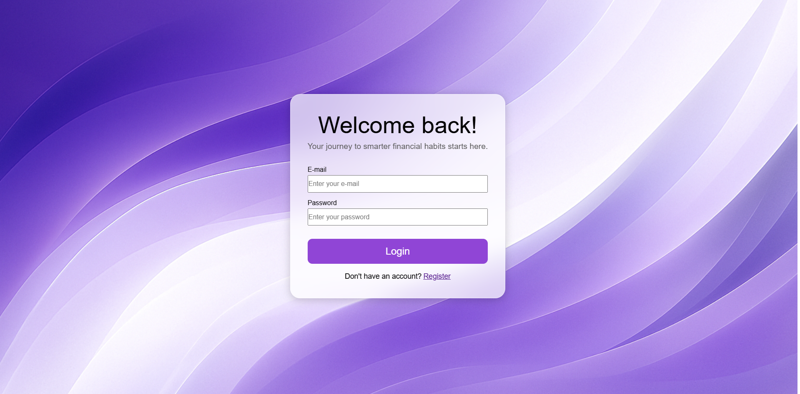
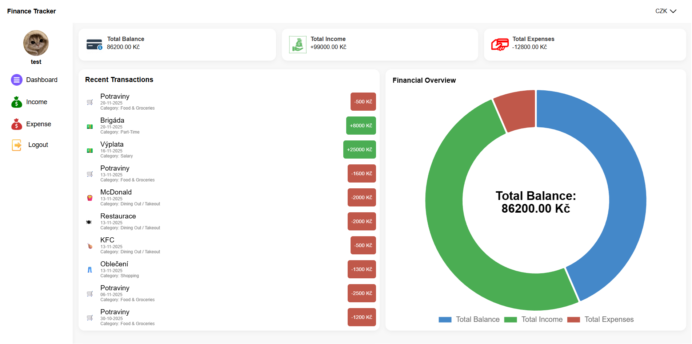
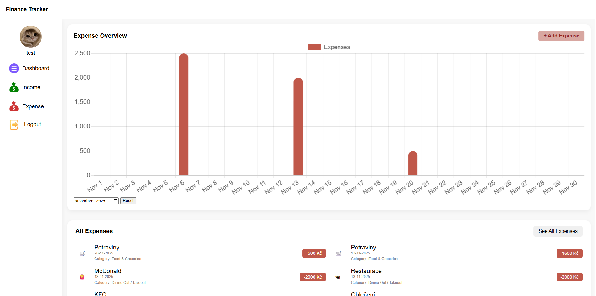
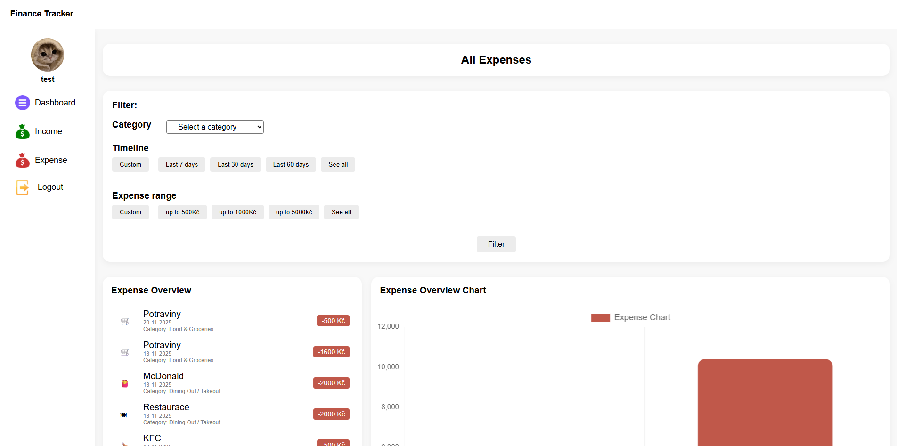

# Personal Finance Tracker app

## Description
Finance Tracker is a full stack web application that allows users to effectively manage their personal income and expenses.
Users can create an account, log in, add and delete financial records and categorize them.
The app provides charts, filters and currency support to help users analyze their spending habits.


## Features
- Add and delete income and expenses
- Filter by categories, time and amount
- Dynamic chart overview of income, expenses and total balance
- Supports 5 currencies: CZK, USD, EUR, GBP, and JPY
- User registration and login
- responsive layout


## Tech stack

### Frontend
- HTML, CSS, Javascript

### Charts
- Chart.js

### Backend
- Node.js, Express.js

### Auth
- JWT + bcrypt

### Database
- MongoDB, Mongoose

### Testing
- Vitest, Testing Library, jsdom


## Installation

### 1. Clone the repository
```bash
git clone https://github.com/Luan2118/finance-tracker-project.git
cd "https://github.com/Luan2118/finance-tracker-project.git"
```

### 2. Install backend dependencies
```bash
npm install
```

### 3. Create .env file and add:
```bash
PORT=
DATABASE_URL= 
ACCESS_TOKEN_SECRET=
REFRESH_TOKEN_SECRET=
CORS_ORIGIN=
```

### 4. Start backend server
```bash
npm start
```

### 5. Start frontend
```bash
Open login.html in Live Server 
```

## Screenshots

### Registration


### Login


### Dashboard


### Expense page


### All Expenses filter page


## Testing

- Unit tests using Vitest
- DOM tests using @testing-library/dom with jsdom
- Integration tests for page flows

To run all tests:
```bash
npm test
```

## Deployment
- finish in the future

## Environment Variables
PORT=
DATABASE_URL= 
ACCESS_TOKEN_SECRET=
REFRESH_TOKEN_SECRET=
CORS_ORIGIN=

